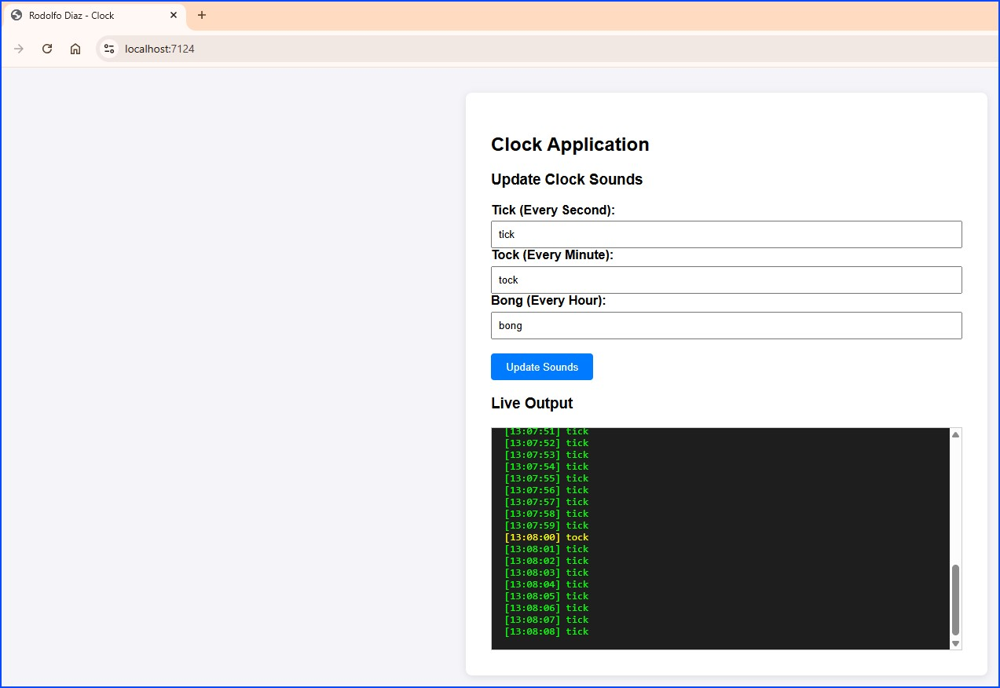
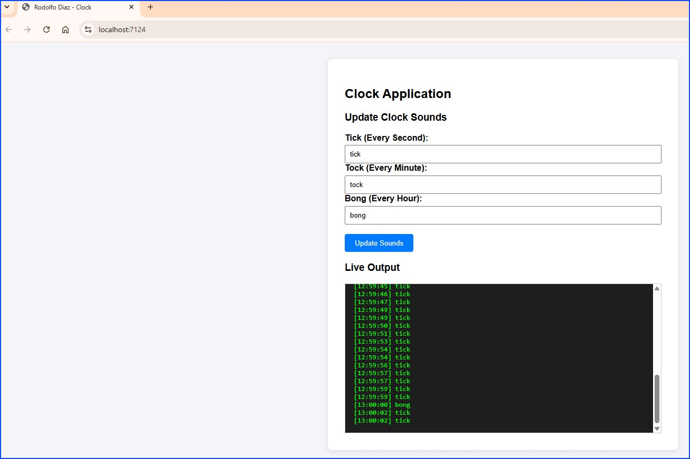
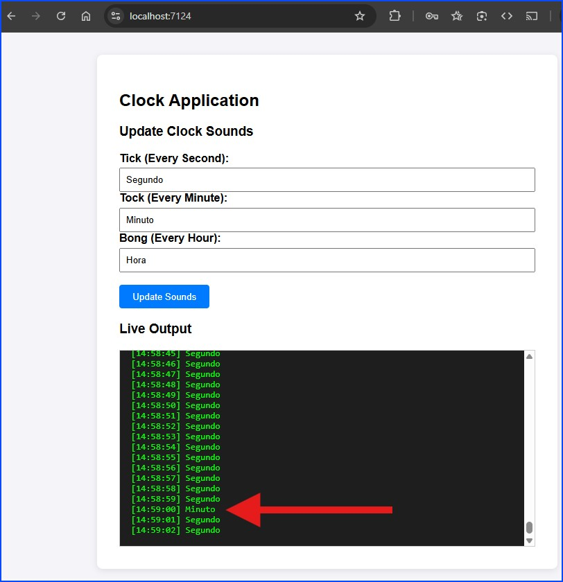
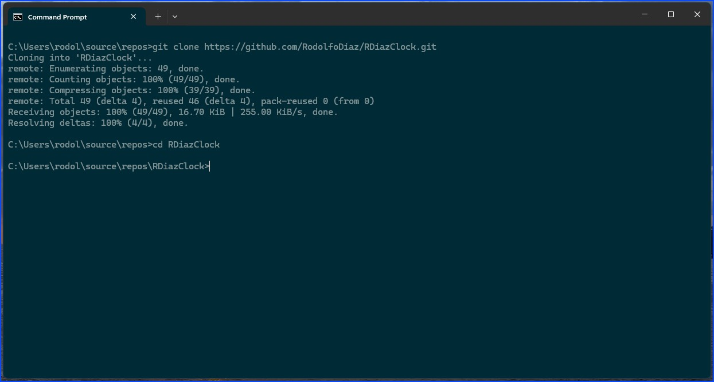
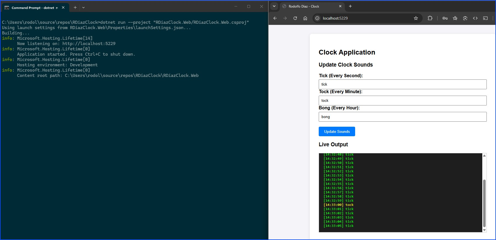
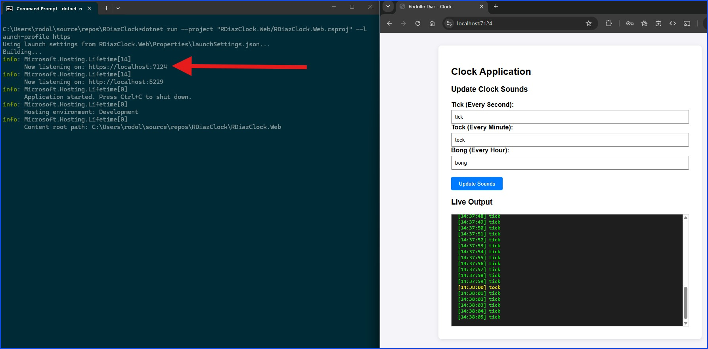
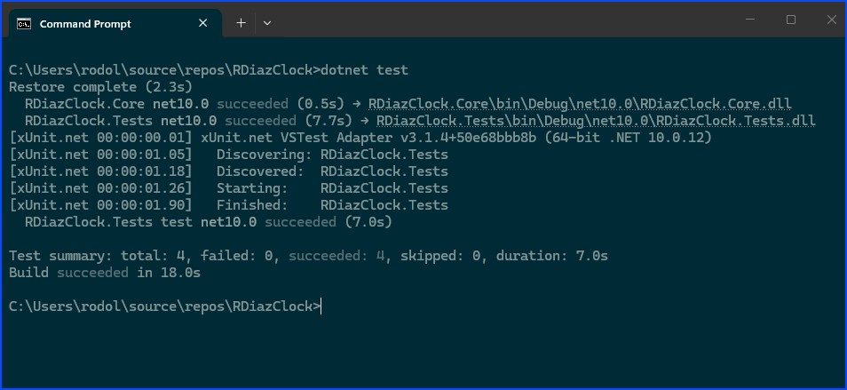
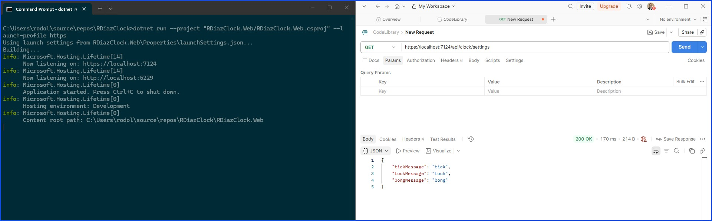
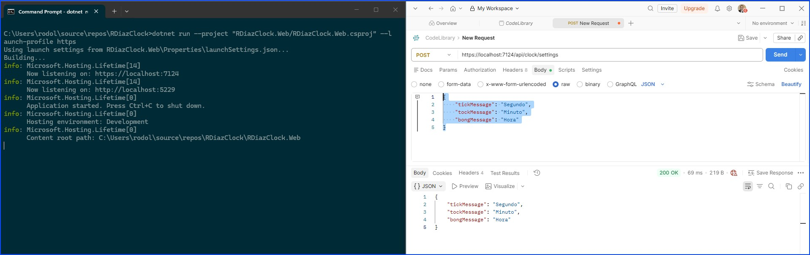
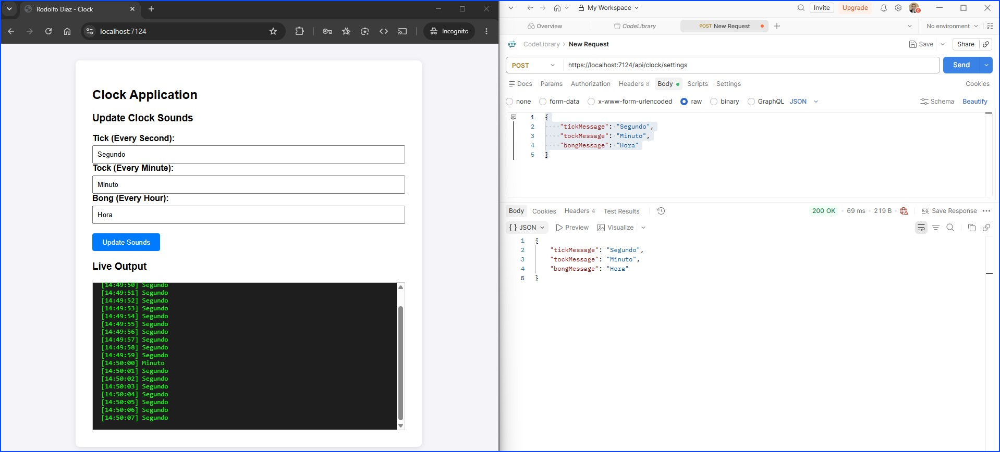

# Clock Application - Rodolfo Díaz C.

An **ASP.NET Core Single Page Application (SPA)** that simulates a clock emitting dynamic audio/text events ("tick", "tock", "bong") at precise time intervals over a 3-hour runtime cycle.

---

## Technical Stack

- **Backend**: .NET 10 / C# (ASP.NET Core Web API + SignalR Hub)
- **Frontend**: HTML5, CSS3, JavaScript (SignalR Client, SPA Architecture)
- **Testing**: xUnit (Unit Tests)

---

## Key Features

- **Interval Priority Printing**:
  - **`tick`**: Emitted every standard second.
  - **`tock`**: Emitted every minute (`Second == 0`), superseding `tick`.
  - **`bong`**: Emitted every hour (`Minute == 0 && Second == 0`), superseding both `tick` and `tock`.
- **Real-time UI SignalR Streaming**: Pushes events to the frontend via WebSockets/SignalR without page refreshes.
- **Dynamic Configuration**: Allows users to alter any clock sound at runtime via HTTP API calls without stopping the execution cycle.
- **3-Hour Lifetime Boundary**: Automatically terminates the application host cleanly after running for three hours.
- **Millisecond System-Clock Alignment**: Prevents second-skipping or duplicate second readings by aligning loop delays directly to system time boundaries.

## User interface

The user will use a Web page to interact with the clock. The system shows an area where you can update the sound (text) and another area for the "Live Output".

The screen shows you a live output panel with clock sounds shown as 'tick' 'tock' (with text):



At the hour, the clock sound changes to 'bong':



You can easily change the clock sounds (text in the live output) by using the text boxes in the Web UI. Also, this change is supported with the API as you will see below in the "API Endpoints" section.



---

## Project Structure

```text
RDiazClock/
├── RDiazClock.Core/          # Core Domain models and business logic (IClockService)
├── RDiazClock.Web/           # ASP.NET Core Web API, Hosted Services, SignalR Hub, and SPA Web Assets
└── RDiazClock.Tests/         # xUnit test project covering interval logic and configuration updates
```

## Getting Started

### Prerequisites

- .NET 10.0 SDK or higher installed.

### Running the Application

1. Clone the repository:

```bash
git clone "https://github.com/RodolfoDiaz/RDiazClock.git"
cd RDiazClock
```



2. Build and Run the Web Project:

```bash
dotnet run --project "RDiazClock.Web/RDiazClock.Web.csproj"
```



For you to run the application with HTTPS, just add the switch (--launch-profile https):

```bash
dotnet run --project "RDiazClock.Web/RDiazClock.Web.csproj" --launch-profile https
```



3. Access the SPA Application:
   Open your web browser and navigate to:

```text
http://localhost:5229  (or https://localhost:7124)
```

## Running Unit Tests

To execute the test suite:

```bash
dotnet test
```



## API Endpoints

| Method | Endpoint            | Description                                          |
| ------ | ------------------- | ---------------------------------------------------- |
| GET    | /api/clock/settings | Retrieves current clock sound settings.              |
| POST   | /api/clock/settings | Updates tick, tock, or bong sound values at runtime. |

### Using Postman Web API tool to inspect the endpoints:

GET Method: You obtain the values for the labels: tick, tock, bong.



POST Method: You assign new values for the labels: tick, tock, bong.



The POST action generated a change that can be seen if you refresh the webpage.


